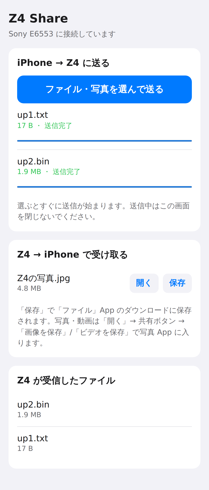

# Z4 Share — Xperia Z4 ⇄ iPhone ファイル送受信アプリ

Xperia Z4 (Z3+ / E6553 系、Android 5.0〜7.1) 向けの Android アプリです。
アプリ起動中、Z4 がローカル Wi-Fi 上で小さな Web サーバーになり、iPhone は **標準のカメラと Safari だけ** で Z4 とファイルをやり取りできます。iPhone 側にアプリを入れる必要はありません。



## 最初に: 「AirDrop の相手として表示される」は実現できません

依頼の要件のうち「iPhone の AirDrop 画面に Z4 が表示される」は、Z4 では技術的に実現できないため、このアプリには含めていません。

| 区分 | 内容 |
|---|---|
| [観測事実] | AirDrop は Bluetooth LE で相手を見つけ、Apple 独自の Wi-Fi 直結方式 **AWDL**（Apple Wireless Direct Link）で通信します。EU の DMA 対応では標準規格 **Wi-Fi Aware** への対応も進んでいます。 |
| [観測事実] | Android から AirDrop に対応した例は、2025 年 11 月の Pixel 10 の Quick Share が最初です。2026 年に Pixel 9 や Galaxy S26 などへ広がりましたが、対応は **Wi-Fi チップ側（ファームウェア）の対応が前提** です。報道でも「ソフトの更新だけでは対応できない」とされています。 |
| [観測事実] | Android の Wi-Fi Aware API は Android 8.0 以降で、さらに対応チップが必要です。Z4 の Android は 7.1 までです。 |
| [合理的推定] | 一般のアプリは Wi-Fi のフレームを直接送受信できないため、AWDL を実装できません。OpenDrop（TU Darmstadt）のように Linux で AirDrop を再現した研究例はありますが、モニターモードと任意フレーム送信に対応した無線 LAN カードとドライバーが必要です。Z4 の root 化まで含めても、実用化の見込みは極めて低いと判断しました。 |

このため、**同じ Wi-Fi（または Z4 のテザリング）+ QR コード + Safari** という、iPhone の標準機能だけで使える方式にしています。

## 使い方

1. Z4 で **Z4 Share** を起動します（初回はストレージの許可を求められます）。
2. iPhone を Z4 と **同じ Wi-Fi** に接続します。
   Wi-Fi が無い場所では、Z4 の「テザリング（Wi-Fi アクセスポイント）」をオンにして、iPhone をそこに接続します。
3. iPhone の **カメラ** で Z4 に表示された QR コードを読み取り、Safari で開きます。

### iPhone → Z4
- 「ファイル・写真を選んで送る」から写真・動画・ファイルを選ぶと、すぐに送信が始まります（複数選択できます）。
- Z4 の **内部ストレージ/Download/Z4Share** に保存され、ギャラリーにも表示されます。

### Z4 → iPhone
- Z4 で「ファイルを追加」を押すか、ギャラリーなどの **共有 →「Z4 Share」** でファイルを追加します。
- iPhone の画面に数秒で表示されます。
  - 「保存」を押すと、「ファイル」App のダウンロードに保存されます。
  - 「開く」→ 共有ボタン →「画像を保存」/「ビデオを保存」で、写真 App に保存できます。

### 終了
- 戻るキーを押してもサーバーは止まらず、裏で動き続けます（通知が出ます）。
- 止めるときは、画面の「停止して終了」か、通知の「停止」を押します。

## ビルド方法

Android Studio（2024.1 以降）で `Z4` フォルダを開き、**Build → Build APK(s)** を実行します。
または、コマンドラインで次を実行します（JDK 17 以上と Android SDK 34 が必要）。

```
./gradlew assembleDebug        # app/build/outputs/apk/debug/app-debug.apk
./gradlew test                 # サーバー部分の単体テスト
```

Z4 へのインストールは、次のどちらかで行います。
- 「設定 → セキュリティ → 提供元不明のアプリ」を許可して、APK をコピーして開く。
- USB デバッグを有効にして `adb install app-debug.apk` を実行する。

## 構成

| ファイル | 役割 |
|---|---|
| `Z4HttpServer.java` | HTTP サーバー本体。Android に依存しないので、JVM でテストできます。トークン認証、アップロードの保存、Range 対応のダウンロード、パストラバーサル対策を担います。 |
| `ShareService.java` | サーバーを動かし続けるフォアグラウンドサービス。WakeLock と WifiLock で、画面が消えても転送が止まらないようにします。 |
| `MainActivity.java` | QR コードの表示、送信リストと受信リスト、共有メニューからの受け取り。 |
| `NetUtil.java` / `QrUtil.java` | LAN 側 IP アドレスの取得（Wi-Fi とテザリング）と、QR コードの生成（ZXing 3.3.3）。 |
| `assets/index.html` | iPhone の Safari に表示するページ（ライト/ダーク両対応）。 |

## セキュリティ

- 起動のたびに 128 bit のランダムなトークンを作り、QR コードの URL に埋め込みます。トークンが無い、または一致しないリクエストはすべて 403 になります。
- 通信は HTTP（暗号化なし）です。同じネットワーク上の第三者が通信を盗聴できるため、公衆 Wi-Fi では使わず、自宅の Wi-Fi か Z4 のテザリングで使ってください。
- アップロードされたファイル名は、パス区切りや制御文字を除去してから保存します。同じ名前があるときは「名前 (1).jpg」のように別名で保存します。

## 検証状況

| 項目 | 結果 |
|---|---|
| サーバーの単体テスト（9 件: 認証、アップロード、途中切断、ダウンロード、Range、パストラバーサル、ファイル名処理） | JVM 上ですべて成功 |
| iPhone 13 相当の画面設定の Chromium（Playwright）で、実際の index.html を使った送受信 | 成功（画面は上のスクリーンショット） |
| Android 14 と Android 7.1 のフレームワーク jar に対するコンパイル | Android 14: エラー 0 件。Android 7.1: エラーは `SDK_INT >= 26/29/33` の分岐内で使う新しい API だけ（Z4 では実行されない経路） |
| APK のビルドと実機（Z4 / iPhone 実機）での動作 | **未検証**。開発環境から Google の Maven リポジトリに接続できず、APK をビルドできなかったためです。 |

## 既知の制約

- iPhone と Z4 が同じネットワークにいる必要があります。一部のルーターは「AP アイソレーション（プライバシーセパレーター）」で端末同士の通信を遮断します。その場合は Z4 のテザリングを使ってください。
- 受信先が Download/Z4Share になるのは Android 9 以下です。Android 10 以降は、アプリ専用フォルダ（Android/data/app.z4share/files/Download）に保存されます。
- iPhone の写真ライブラリから HEIC の写真を選ぶと、iOS の設定によっては JPEG に変換されてから送られます。
